# Voygo Block Diagrams

Generated for the current TravelComposeApp iOS + backend project.

This document is diagram-first. It shows the app as blocks, flows, and data
relationships so the product and engineering shape is easy to explain.

## 1. System Context

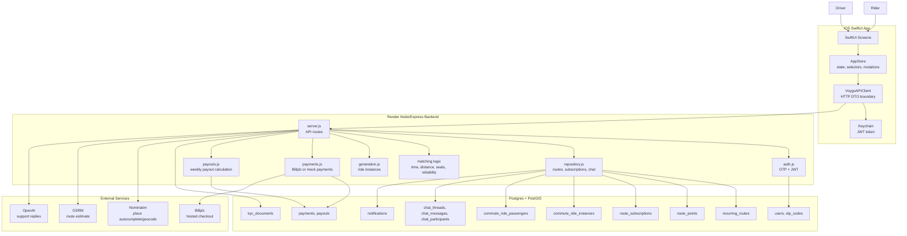

## 2. iOS App Block Diagram

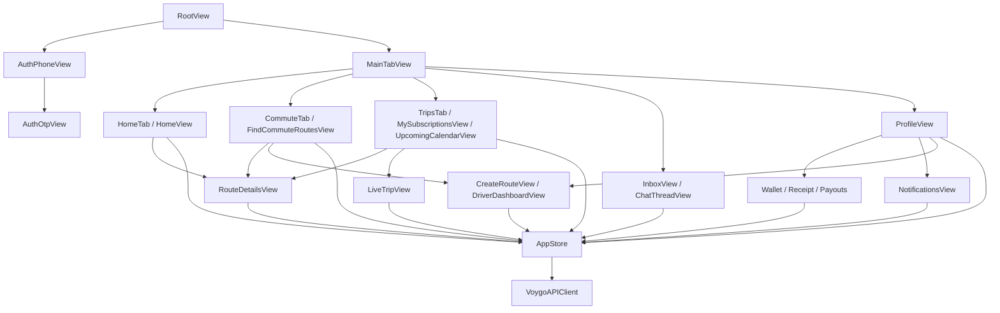

## 3. Backend Block Diagram

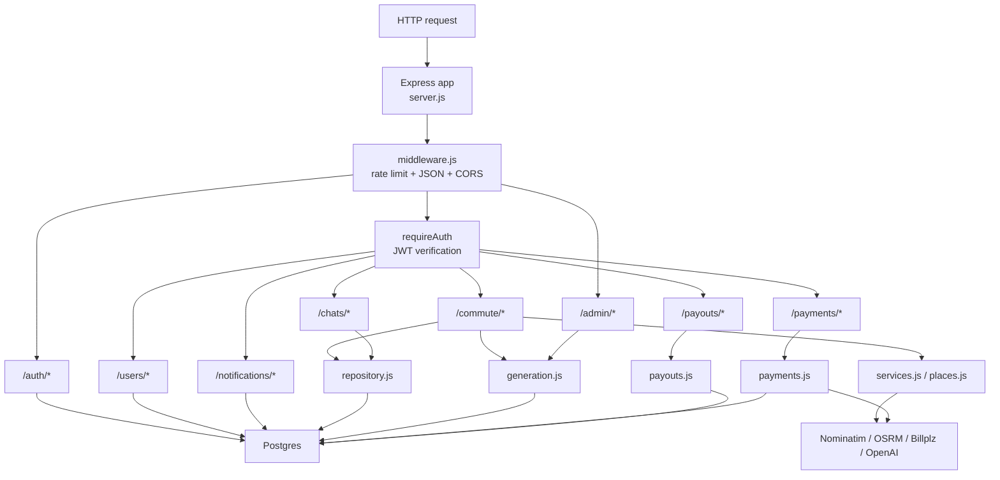

## 4. Authentication Flow

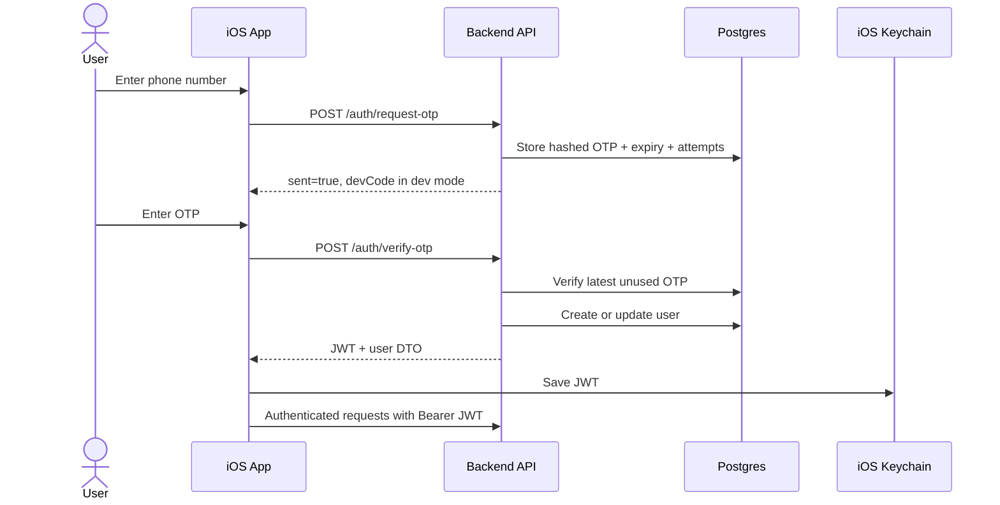

## 5. Rider Search To Subscription Flow

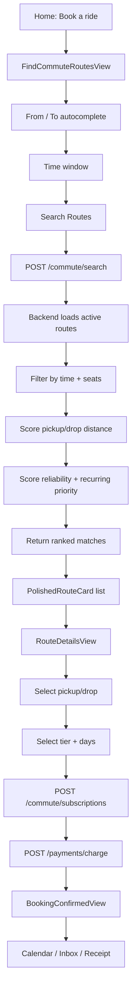

## 6. Subscription Safety Flow

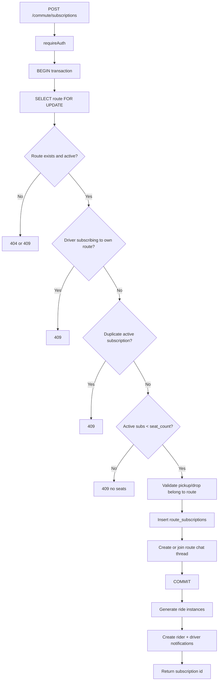

## 7. Adaptive Home Flow

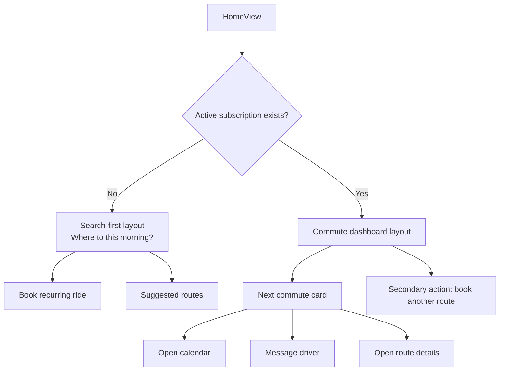

Note: this is the recommended product flow. The current app still needs the
subscribed-user Home dashboard to be fully wired.

## 8. Driver Route Flow

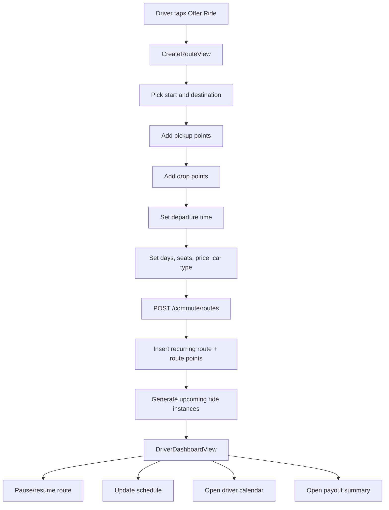

## 9. Chat Flow

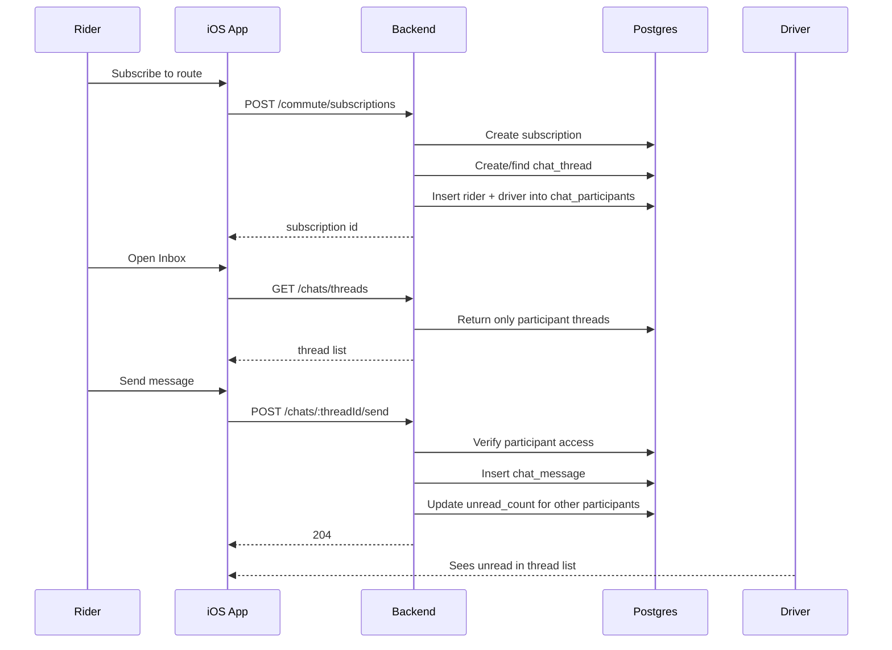

## 10. Notifications Flow

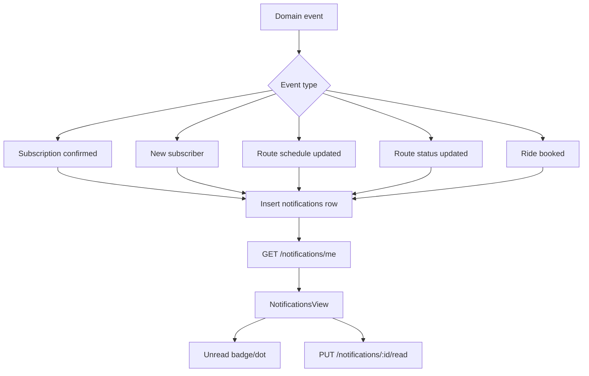

Note: backend notification routes exist. The iOS notification feed still needs
to call them.

## 11. One-Off Ride Booking Flow

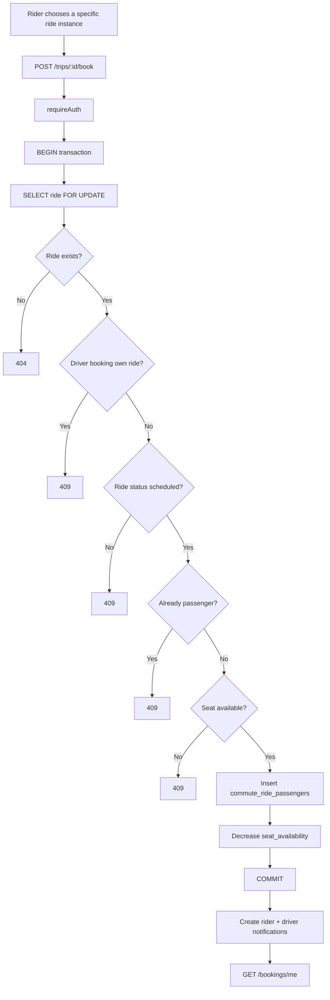

Note: backend booking routes exist. The iOS app still needs UI/API methods for
one-off booking.

## 12. Payment Flow

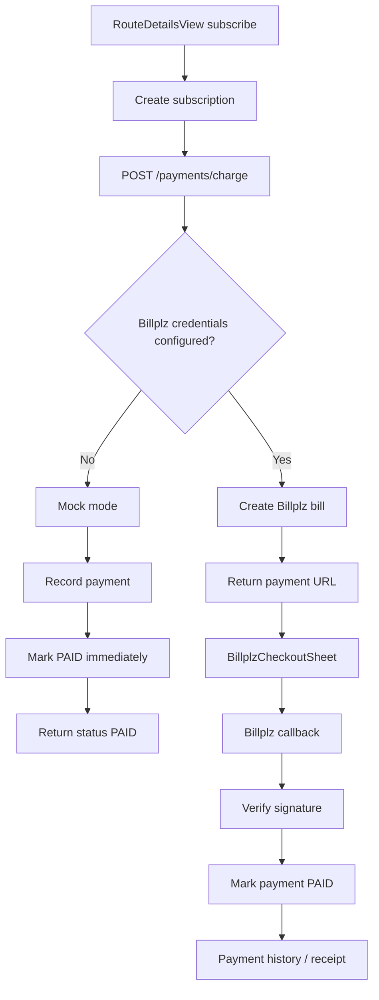

## 13. Weekly Driver Payout Flow

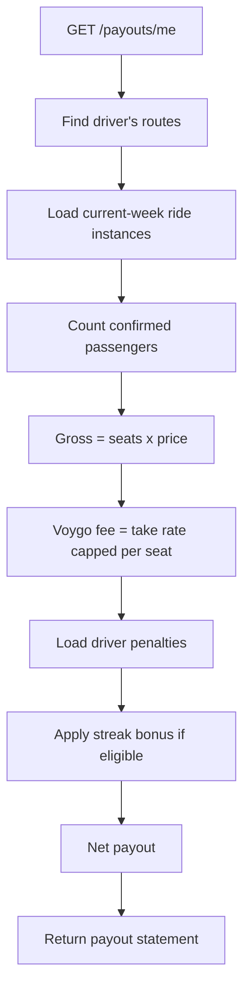

## 14. Core Data Model

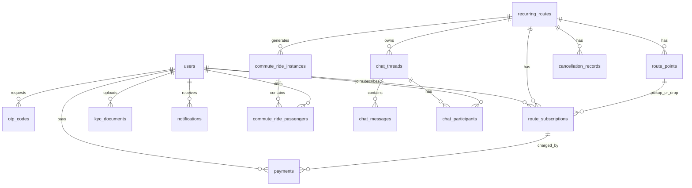

## 15. Deployment Flow

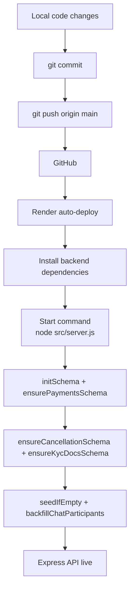

## 16. Product Flow Summary

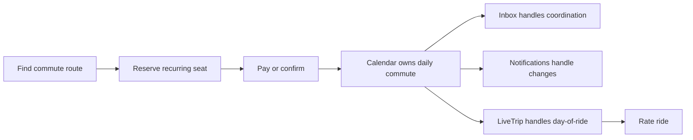

## 17. Current Missing Connections

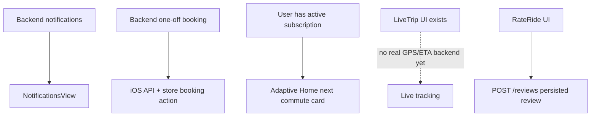
